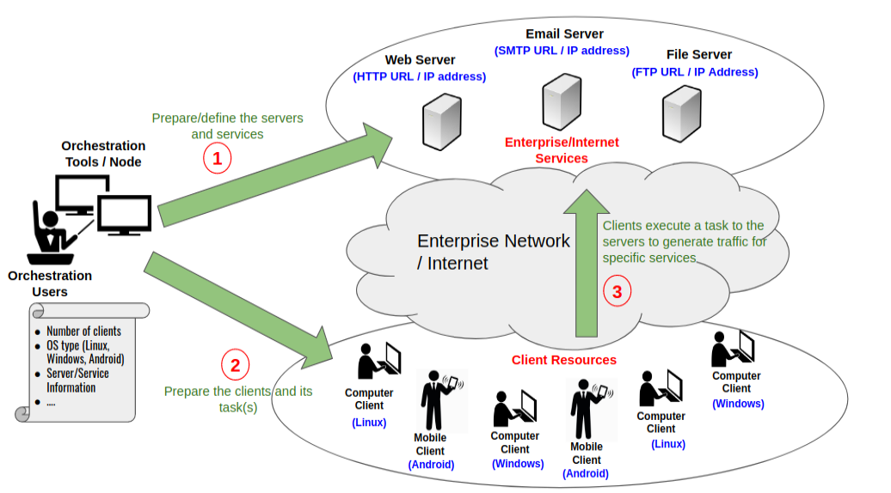

# Human-behave Traffic Generator

## Definition

An unique orchestration system or tool to be used to emulate a "human" for generating random and various traffic (e.g., web browsing, email, file transfer, ...) which is modular or flexible implementation, scalable for huge number client/service, and simple/lightweight execution through CLI or API (application programming interface).

## Motivation and use cases

There are several reasons behind the development of this system or tool, which are:

1. "White team" emulation during "Cyber Defence Exercise" or "Capture The Flag" Game
2. Requirement of random and learning-based packet generator for verifying or testing an intelligent security detection system

## Overall requirement and scenario

It has several components which are explained below:

1. **Orchestrator** - System/tool that is accessible and manageable to the user for generating the traffic by defining traffic specification (e.g., number of client, services, type of client, ...) 
2. **Server / Services** - Specific IP/URL address of the server to represent services that will be defined and accessed by the client for generating the traffic
3. **Network** - Network topology or share network devices that are used to connect between the client and the server/services for generating the traffic 
4. **Client** - Specific human-based agent with learning-based capability that generates random traffic based on the time scheduler, received response and others 

## Perquisites and dependencies

In order to understand about how the system or tool will help to randomly generate traffic with modular, scalable and simple features, there are several concepts or ideas which need to be explored and learned.

### Linux Container ###

### Container Orchestrator ###

### Services (Client - Server Communication ###

### Basic Networking (DHCP and NAT)

### CLI-based vs API-based Communication ### 